# 🍽️ POS MVP - Point of Sale System

A complete Point of Sale (POS) system with real-time order management, built with modern web technologies.

## 🎯 Overview

This POS MVP system consists of three main applications:

1. **pos-backend** - NestJS REST API with WebSocket support
2. **pos-staff** - Angular 19 staff management application
3. **pos-customer** - Angular 19 customer ordering application

All applications work together to provide a complete real-time order management system with dual-sync capabilities (Firebase + WebSocket).

## 🚀 Quick Setup

### Prerequisites
- Node.js 18+ and npm
- Firebase project (see [Firebase Setup](#firebase-setup) below)
- Git

### Installation Steps

1. **Clone the repository**
   ```bash
   git clone <repository-url>
   cd pos-mvp
   ```

2. **Setup Backend**
   ```bash
   cd pos-backend
   npm install

   # Create .env file (see Firebase Setup section)
   cp .env.example .env
   # Edit .env and add your Firebase credentials

   npm run start:dev
   ```

3. **Setup Staff App**
   ```bash
   cd pos-staff
   npm install
   npm start
   # Opens at http://localhost:4200
   ```

4. **Setup Customer App**
   ```bash
   cd pos-customer
   npm install
   npm start
   # Opens at http://localhost:4201
   ```

## 🔥 Firebase Setup

### Step 1: Create Firebase Project

1. Go to [Firebase Console](https://console.firebase.google.com/)
2. Click "Add project"
3. Enter project name (e.g., "pos-mvp")
4. Disable Google Analytics (optional)
5. Click "Create project"

### Step 2: Enable Firestore Database

1. In Firebase Console, go to **Build** → **Firestore Database**
2. Click "Create database"
3. Select **Start in test mode** (for development)
4. Choose a location (e.g., us-central)
5. Click "Enable"

### Step 3: Get Firebase Credentials

#### For Backend (Service Account)

1. Go to **Project Settings** (gear icon) → **Service Accounts**
2. Click "Generate new private key"
3. Save the JSON file securely
4. Copy the entire JSON content
5. In `pos-backend/.env`, set:
   ```env
   FIREBASE_CREDENTIALS={"type":"service_account","project_id":"your-project-id",...}
   ```
   Or use the file path:
   ```env
   FIREBASE_CREDENTIALS_PATH=./path/to/serviceAccountKey.json
   ```

#### For Frontend Apps (Web Config)

1. Go to **Project Settings** → **General**
2. Scroll to "Your apps" section
3. Click the **Web** icon (`</>`)
4. Register app with nickname (e.g., "pos-staff")
5. Copy the `firebaseConfig` object
6. Update both:
   - `pos-staff/src/environments/environment.ts`
   - `pos-customer/src/environments/environment.ts`

   ```typescript
   export const environment = {
     production: false,
     apiUrl: 'http://localhost:3000/api/v1',
     wsUrl: 'ws://localhost:3000',
     firebase: {
       apiKey: "your-api-key",
       authDomain: "your-project.firebaseapp.com",
       projectId: "your-project-id",
       storageBucket: "your-project.appspot.com",
       messagingSenderId: "123456789",
       appId: "your-app-id"
     }
   };
   ```

### Step 4: Seed Initial Data

```bash
cd pos-backend
npm run seed
```

This will create:
- Demo staff user (`staff@demo.com`)
- Sample menu items
- Test orders

## 🏗️ System Architecture

### High-Level Architecture

```mermaid
graph TB
    subgraph "Frontend Applications"
        Customer["🛒 pos-customer<br/>Port: 4201<br/><br/>• Browse Menu<br/>• Place Orders<br/>• Track Status"]
        Staff["👨‍💼 pos-staff<br/>Port: 4200<br/><br/>• Staff Login<br/>• Create Orders<br/>• Manage Orders"]
    end

    subgraph "Backend Services"
        API["⚙️ pos-backend<br/>Port: 3000<br/><br/>• REST API<br/>• WebSocket Gateway<br/>• JWT Auth<br/>• Order Management"]
    end

    subgraph "Data Layer"
        Firebase["🔥 Firebase Firestore<br/><br/>• Real-time Database<br/>• Order Storage<br/>• User Management<br/>• Offline Support"]
    end

    Customer -->|HTTP/WebSocket| API
    Staff -->|HTTP/WebSocket| API
    API -->|Firebase Admin SDK| Firebase

    Customer -.->|Firestore Listeners| Firebase
    Staff -.->|Firestore Listeners| Firebase

    style Customer fill:#e3f2fd
    style Staff fill:#fff3e0
    style API fill:#f3e5f5
    style Firebase fill:#fff9c4
```



### Data Flow Architecture


## 📦 Applications

### 1. pos-backend (NestJS API)

**Location**: `./pos-backend`  
**Port**: 3000  
**Purpose**: Backend REST API with real-time WebSocket support

**Key Features**:
- ✅ RESTful API with Swagger documentation
- ✅ JWT authentication for staff
- ✅ Firebase Firestore integration
- ✅ WebSocket gateway for real-time updates
- ✅ Order management (CRUD operations)
- ✅ Menu management
- ✅ Write queue with retry logic
- ✅ Caching layer for performance

**Quick Start**:
```bash
cd pos-backend
npm install
npm run start:dev
```

📖 **[Full Documentation](./pos-backend/README.md)**

### 2. pos-staff (Staff Application)

**Location**: `./pos-staff`  
**Port**: 4200  
**Purpose**: Staff-facing application for order management

**Key Features**:
- ✅ Staff authentication (login required)
- ✅ Dashboard with active orders
- ✅ Create new orders
- ✅ Update order status
- ✅ Real-time sync (Firebase + WebSocket)
- ✅ Material Design UI

**Quick Start**:
```bash
cd pos-staff
npm install
npm start
```

📖 **[Full Documentation](./pos-staff/README.md)**

### 3. pos-customer (Customer Application)

**Location**: `./pos-customer`  
**Port**: 4201  
**Purpose**: Customer-facing application for online ordering

**Key Features**:
- ✅ Browse menu items
- ✅ Add items to cart
- ✅ Place orders (no login required)
- ✅ Track order status in real-time
- ✅ Real-time sync (Firebase + WebSocket)
- ✅ Material Design UI

**Quick Start**:
```bash
cd pos-customer
npm install
npm start
```

📖 **[Full Documentation](./pos-customer/README.md)**

## 🔑 Demo Credentials

The backend comes with pre-seeded demo users:

### Staff Login
- **Email**: `staff@demo.com`
- **Password**: `DemoPos@123!`
- **Role**: Staff

**Note**: Customer app does not require login.

## 🛠️ Tech Stack

### Backend
- **Framework**: NestJS 11
- **Language**: TypeScript 5.9
- **Database**: Firebase Firestore
- **Authentication**: JWT
- **Real-time**: Socket.io WebSocket
- **API Docs**: Swagger/OpenAPI
- **Validation**: class-validator
- **Caching**: LRU Cache + LevelDB

### Frontend (Both Apps)
- **Framework**: Angular 19 (Standalone Components)
- **Language**: TypeScript 5.6
- **UI Library**: Angular Material
- **State Management**: Angular Signals + RxJS
- **Real-time Sync**: Firebase SDK + WebSocket
- **HTTP Client**: Angular HttpClient
- **Forms**: Reactive Forms

## ✨ Features

### Real-Time Synchronization

This system uses a **dual-sync strategy** for maximum reliability and real-time updates.

#### How Real-Time Sync Works

```
┌─────────────────────────────────────────────────────────────────┐
│                    Real-Time Sync Architecture                   │
└─────────────────────────────────────────────────────────────────┘

    Frontend Apps (Staff & Customer)
           │
           ├─── Primary: Firebase Firestore Listeners
           │    • onSnapshot() for real-time updates
           │    • Automatic reconnection
           │    • Offline persistence
           │
           └─── Fallback: WebSocket (Socket.io)
                • Connects to backend gateway
                • Receives order:created, order:updated events
                • Automatic reconnection with exponential backoff

    Backend (NestJS)
           │
           ├─── WebSocket Gateway
           │    • Broadcasts order events to all connected clients
           │    • Room-based subscriptions
           │
           └─── Firebase Admin SDK
                • Writes to Firestore
                • Triggers Firestore listeners in frontend
```

#### Sync Flow Example

**When a staff member updates an order status:**

1. **Staff App** → Calls backend API: `PATCH /api/orders/:id/status`
2. **Backend** → Writes to Firestore + Emits WebSocket event
3. **Firestore** → Triggers `onSnapshot()` listeners in all connected apps
4. **WebSocket** → Sends `order:updated` event to all connected clients
5. **Customer App** → Receives update via BOTH channels
6. **UI Updates** → Order status changes instantly (< 100ms)

#### Dual-Sync Benefits

- ✅ **Reliability**: If one sync method fails, the other continues working
- ✅ **Speed**: WebSocket provides instant updates (< 50ms)
- ✅ **Persistence**: Firestore provides offline support and data persistence
- ✅ **Scalability**: Firebase handles millions of concurrent connections
- ✅ **Automatic Failover**: Seamlessly switches between sync methods
- ✅ **Connection Status**: Visual indicators show sync health

#### Implementation Details

**Frontend (Angular)**:
```typescript
// Firebase Firestore listener
this.firestore.collection('orders')
  .onSnapshot(snapshot => {
    snapshot.docChanges().forEach(change => {
      if (change.type === 'modified') {
        this.updateOrderInUI(change.doc.data());
      }
    });
  });

// WebSocket listener (fallback)
this.socket.on('order:updated', (order) => {
  this.updateOrderInUI(order);
});
```

**Backend (NestJS)**:
```typescript
// Write to Firestore
await this.firestore.collection('orders').doc(id).update(data);

// Emit WebSocket event
this.server.emit('order:updated', updatedOrder);
```

### Order Management
- **Create Orders**: Staff and customers can create orders
- **Status Workflow**: Pending → In Progress → Ready → Completed
- **Order Tracking**: Real-time status updates for customers
- **Order History**: View completed orders

### Menu Management
- **Menu Items**: Pre-seeded with demo items
- **Stock Tracking**: Low stock and out-of-stock indicators
- **Pricing**: Dynamic pricing with discount support

### Authentication & Security
- **JWT Tokens**: Secure authentication for staff
- **Route Guards**: Protected routes in staff app
- **HTTP Interceptors**: Automatic token attachment
- **Role-Based Access**: Staff and Manager roles

### Performance
- **Caching**: Menu items cached for fast loading
- **Write Queue**: Resilient write operations with retry logic
- **Optimistic Updates**: Instant UI feedback
- **Lazy Loading**: Components loaded on demand

## 📁 Project Structure

```
pos-mvp/
├── pos-backend/              # NestJS Backend API
│   ├── src/
│   │   ├── auth/            # Authentication module
│   │   ├── orders/          # Order management
│   │   ├── menu/            # Menu management
│   │   ├── users/           # User management
│   │   ├── firebase/        # Firebase integration
│   │   ├── cache/           # Caching layer
│   │   └── common/          # Shared utilities
│   ├── scripts/             # Utility scripts
│   ├── .env                 # Environment variables
│   └── README.md
│
├── pos-staff/               # Staff Angular App
│   ├── src/
│   │   ├── app/
│   │   │   ├── components/  # UI components
│   │   │   ├── services/    # Business logic
│   │   │   ├── guards/      # Route guards
│   │   │   ├── interceptors/# HTTP interceptors
│   │   │   └── models/      # TypeScript interfaces
│   │   └── environments/    # Environment configs
│   └── README.md
│
└── pos-customer/            # Customer Angular App
    ├── src/
    │   ├── app/
    │   │   ├── components/  # UI components
    │   │   ├── services/    # Business logic
    │   │   └── models/      # TypeScript interfaces
    │   └── environments/    # Environment configs
    └── README.md
```

## 🧪 Testing the System

### 1. Test Customer Flow
1. Open http://localhost:4201 (customer app)
2. Browse menu items
3. Add items to cart
4. Go to checkout
5. Enter name and address
6. Place order
7. Note the order ID
8. Track order status in real-time

### 2. Test Staff Flow
1. Open http://localhost:4200 (staff app)
2. Login with `staff@demo.com` / `DemoPos@123!`
3. View dashboard with active orders
4. Click "Manage Orders"
5. Find the customer's order
6. Update status: Pending → In Progress → Ready → Completed
7. Watch customer app update in real-time!

### 3. Test Real-Time Sync
1. Open customer app in one browser
2. Open staff app in another browser
3. Create/update orders in staff app
4. Watch updates appear instantly in customer app
5. Check connection status indicators

## 🔒 Security Best Practices

- ✅ Never commit `.env` files or Firebase credentials
- ✅ Use environment variables for all secrets
- ✅ Rotate JWT secrets regularly
- ✅ Use HTTPS in production
- ✅ Enable CORS only for trusted origins
- ✅ Implement rate limiting (already configured)
- ✅ Validate all user inputs
- ✅ Use Firebase security rules